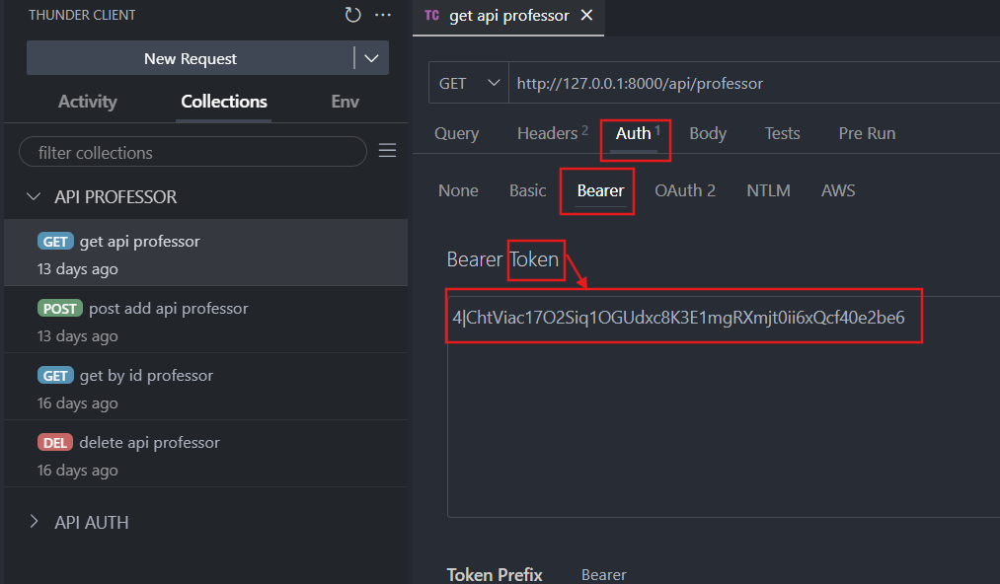

# Proyecto de Gestión de Solicitud de Alumnos

Este proyecto es una aplicación web para gestionar las solicitudes de alumnado de FPDual por parte de las empresas.

## Funcionalidades Implementadas

### Gestión de Profesores

- **Crear nuevo profesor**: Permite registrar un nuevo profesor en el sistema.
- **Editar profesor**: Permite modificar la información de un profesor existente.
- **Ver detalles del profesor**: Permite visualizar la información detallada de un profesor.
- **Eliminar profesor**: Permite eliminar un profesor del sistema.

### Gestión de Empresas

- **Crear nueva empresa**: Permite registrar una nueva empresa en el sistema.
- **Editar empresa**: Permite modificar la información de una empresa existente.
- **Ver detalles de la empresa**: Permite visualizar la información detallada de una empresa.
- **Eliminar empresa**: Permite eliminar una empresa del sistema.

### Gestión de Solicitudes

- **Crear nueva solicitud**: Permite registrar una nueva solicitud en el sistema.
- **Editar solicitud**: Permite modificar la información de una solicitud existente.
- **Ver detalles de la solicitud**: Permite visualizar la información detallada de una solicitud.
- **Eliminar solicitud**: Permite eliminar una solicitud del sistema.

### Relación entre Empresas y Solicitudes

- **Relación 1:N**: Cada empresa puede tener múltiples solicitudes asociadas.

### Seeder, Factory y Faker

- **Seeder**: Se han creado seeders para poblar la base de datos con datos iniciales.
- **Factory**: Se han creado factories para generar datos de prueba.
- **Faker**: Se utiliza Faker para generar datos aleatorios y realistas para pruebas y desarrollo.

# 📚 Configuración de la API para la Gestión de Applications

## 1. **Modelo `Application`**

- El modelo `Application` tiene una relación **pertenece a** `Company`, definida en `Application.php` mediante el método `company()`.
- Los campos relevantes como `nif`, `company_activity`, `smr_1`, etc., están definidos en la propiedad `$fillable`.

## 2. **Request Personalizado (`ApplicationRequest.php`)**

- Validación de los datos de entrada mediante `ApplicationRequest`.
- Los campos requeridos incluyen `nif`, `company_activity`, `modality`, y `company_id`, este último verificando que el `company_id` exista en la base de datos.
- Mensajes de error personalizados para cada campo obligatorio.

## 3. **Controlador `ApplicationController.php`**

El controlador maneja los métodos para las operaciones CRUD (Crear, Leer, Actualizar, Eliminar) de las `Applications`.

### **Método `index()`**

- El método `index()` se usa para obtener todas las aplicaciones.
- Se retorna un conjunto de todas las aplicaciones registradas.

### **Método `store()`**

- El método `store()` se usa para crear una nueva `Application`.
- Los datos de la solicitud son validados utilizando el `ApplicationRequest`, y luego se guardan en la base de datos.
- Se retorna un recurso `ApplicationResource` con los datos de la nueva aplicación.

### **Método `show()`**

- El método `show()` se usa para obtener los detalles de una aplicación específica mediante su ID.
- Se retorna un recurso `ApplicationResource` con los detalles de la aplicación solicitada.

### **Método `update()`**

- El método `update()` se usa para actualizar los datos de una aplicación existente.
- Los datos de la solicitud son validados mediante `ApplicationRequest`, y luego se actualizan en la base de datos.
- Se retorna el recurso `ApplicationResource` con los datos actualizados.

### **Método `destroy()`**

- El método `destroy()` se usa para eliminar una aplicación específica mediante su ID.
- Se retorna un mensaje confirmando la eliminación.

## 4. **Rutas (`api.php`)**

Las rutas correspondientes a los métodos anteriores están registradas en el archivo `api.php`:

- **GET `/api/applications`**: `index()` — Obtiene todas las aplicaciones.
- **POST `/api/applications`**: `store()` — Crea una nueva aplicación.
- **GET `/api/applications/{applicationId}`**: `show()` — Obtiene los detalles de una aplicación específica.
- **PUT `/api/applications/{applicationId}`**: `update()` — Actualiza los detalles de una aplicación específica.
- **DELETE `/api/applications/{applicationId}`**: `destroy()` — Elimina una aplicación específica.

Aunque usando Resource no hace falta que creemos todas las rutas ya que Laravel lo hace por nosotros, podemos listarlas con php artisan route:list

## 5. **Pruebas con Thunder Client**

### **GET: Obtener todas las Aplicaciones**

- **Thunder Client:** Se debe enviar una solicitud **GET** a `http://localhost/api/applications` para obtener todas las aplicaciones registradas en el sistema.

**Ejemplo de respuesta**:

```json
[
  {
    "id": 1,
    "nif": "96216229C",
    "company_activity": "Bases de datos",
    "smr_1": 1,
    "smr_2": 1,
    "dam_1": 1,
    "dam_2": 1,
    "daw_1": 1,
    "daw_2": 1,
    "observations": "otras",
    "modality": "Presencial",
    "company_id": 1
  },
  {
    "id": 2,
    "nif": "12345678A",
    "company_activity": "Software",
    "smr_1": 2,
    "smr_2": 2,
    "dam_1": 1,
    "dam_2": 2,
    "daw_1": 2,
    "daw_2": 1,
    "observations": "Comentarios",
    "modality": "Remoto",
    "company_id": 2
  }
]
```

---

### **POST: Crear una Aplicación**

- **Thunder Client:** Se debe enviar una solicitud **POST** con **Content-Type: application/json** y un JSON con los campos correctos.

**Ejemplo de cuerpo de la solicitud**:

```json
{
    "nif": "96216229C",
    "company_activity": "Bases de datos",
    "smr_1": 1,
    "smr_2": 1,
    "dam_1": 1,
    "dam_2": 1,
    "daw_1": 1,
    "daw_2": 1,
    "observations": "otras",
    "modality": "Presencial",
    "company_id": 1
}
```

**Ejemplo de respuesta** (si la creación es exitosa):

```json
{
  "data": {
    "id": 1,
    "nif": "96216229C",
    "company_activity": "Bases de datos",
    "smr_1": 1,
    "smr_2": 1,
    "dam_1": 1,
    "dam_2": 1,
    "daw_1": 1,
    "daw_2": 1,
    "observations": "otras",
    "modality": "Presencial",
    "company_id": 1
  }
}
```

---

### **GET por ID: Ver una Solicitud Específica**

- **Thunder Client:** Se debe enviar una solicitud **GET** a `http://localhost/api/applications/{applicationId}` donde `{applicationId}` es el ID de la aplicación que quieres obtener.

**Ejemplo de respuesta**:

```json
{
  "id": 1,
  "nif": "96216229C",
  "company_activity": "Bases de datos",
  "smr_1": 1,
  "smr_2": 1,
  "dam_1": 1,
  "dam_2": 1,
  "daw_1": 1,
  "daw_2": 1,
  "observations": "otras",
  "modality": "Presencial",
  "company_id": 1
}
```

---

### **PUT: Actualizar una Aplicación**

- **Thunder Client:** Se debe enviar una solicitud **PUT** con **Content-Type: application/json** y un JSON con los campos actualizados.

**Ejemplo de cuerpo de la solicitud**:

```json
{
    "nif": "12345678B",
    "company_activity": "Marketing",
    "smr_1": 3,
    "smr_2": 2,
    "dam_1": 2,
    "dam_2": 2,
    "daw_1": 2,
    "daw_2": 1,
    "observations": "Actualización",
    "modality": "Híbrido",
    "company_id": 1
}
```

**Ejemplo de respuesta**:

```json
{
  "data": {
    "id": 1,
    "nif": "12345678B",
    "company_activity": "Marketing",
    "smr_1": 3,
    "smr_2": 2,
    "dam_1": 2,
    "dam_2": 2,
    "daw_1": 2,
    "daw_2": 1,
    "observations": "Actualización",
    "modality": "Híbrido",
    "company_id": 1
  }
}
```

---

### **DELETE: Eliminar una Aplicación**

- **Thunder Client:** Se debe enviar una solicitud **DELETE** a `http://localhost/api/applications/{applicationId}` donde `{applicationId}` es el ID de la aplicación que quieres eliminar.

**Ejemplo de URL**:

```
http://localhost/api/applications/1
```

**Ejemplo de respuesta**:

```json
{
  "message": "Application deleted successfully"
}

```

---

## 6. Autenticación

Este proyecto utiliza Laravel Sanctum para manejar la autenticación de las API. A continuación se describen los detalles sobre la autenticación y las rutas protegidas.

### Rutas Públicas

Las siguientes rutas están disponibles sin autenticación:

-`POST /register`: Registra un nuevo usuario.

-`POST /login`: Autentica un usuario y devuelve un token de acceso.

### Rutas Protegidas

Las siguientes rutas están protegidas y requieren autenticación mediante un token de acceso:

-`GET /application`: Lista todas las aplicaciones.

-`POST /application`: Crea una nueva aplicación.

-`GET /application/{id}`: Muestra una aplicación específica.

-`PUT /application/{id}`: Actualiza una aplicación específica.

-`DELETE /application/{id}`: Elimina una aplicación específica.

-`GET /professor`: Lista todos los profesores.

-`POST /professor`: Crea un nuevo profesor.

-`GET /professor/{id}`: Muestra un profesor específico.

-`PUT /professor/{id}`: Actualiza un profesor específico.

-`DELETE /professor/{id}`: Elimina un profesor específico.

-`GET /company`: Lista todas las compañías.

-`POST /company`: Crea una nueva compañía.

-`GET /company/{id}`: Muestra una compañía específica.

-`PUT /company/{id}`: Actualiza una compañía específica.

-`DELETE /company/{id}`: Elimina una compañía específica.

### Uso de Tokens

Para acceder a las rutas protegidas, los usuarios deben autenticarse y obtener un token de acceso. Este token debe ser incluido en el encabezado de las solicitudes a las rutas protegidas.

Ejemplo de encabezado de autorización:



### Middleware de Autenticación

Las rutas protegidas están envueltas en un middleware de autenticación que verifica la validez del token de acceso. Si el token es válido, el usuario puede acceder a la ruta; de lo contrario, se devuelve un error de autenticación.

```php


Route::middleware('auth:sanctum')->group(function () {
    Route::resource('application', ApplicationApiController::class);
    Route::resource('professor', ProfessorApiController::class);
    Route::resource('company', CompanyApiController::class);
});
```


---

## 7. Tests

### ¿Para qué sirven los tests?

Los tests son una parte fundamental del desarrollo de software, ya que permiten verificar que el código funciona correctamente y cumple con los requisitos especificados. Ayudan a detectar errores y problemas antes de que el software sea desplegado en producción, asegurando así la calidad y la estabilidad del proyecto.

### Tipos de tests

En este proyecto, hemos implementado los siguientes tipos de tests:

-**Unit Tests**: Verifican el funcionamiento de unidades individuales de código, como funciones o métodos.

-**Feature Tests**: Verifican el comportamiento de características completas del sistema, incluyendo la interacción entre múltiples unidades de código.

### ¿Cómo se crean los tests?

Para crear un test en Laravel, puedes usar el comando `make:test` de Artisan. Por ejemplo, para crear un test de unidad, puedes ejecutar

```
php artisan make:test ExampleTest --unit
```

Para crear un test de características, puedes ejecutar:

```
php artisan make:test ExampleFeatureTest
```

Los tests se crean en el directorio `test` de tu proyecto. Los tests de unidad se colocan en `tests/Unit` y los tests de características en [`Feature`](vscode-file://vscode-app/c:/Users/sergi/AppData/Local/Programs/Microsoft%20VS%20Code/resources/app/out/vs/code/electron-sandbox/workbench/workbench.html).

### ¿Cómo se ejecutan los tests?

Para ejecutar los tests, puedes usar el comando `test` de Artisan:

```
php artisan test
```

Este comando ejecutará todos los tests en el proyecto y mostrará un resumen de los resultados, incluyendo cuántos tests pasaron, fallaron o fueron omitidos.

### Tests implementados

En este proyecto, hemos implementado los siguientes tests:

#### Unit Tests

* **ProfesorTest** : Verifica la funcionalidad del modelo `Profesor`.
* **ApplicationTest** : Verifica la funcionalidad del modelo `Application`.

#### Feature Tests

* **AuthTest** : Verifica el proceso de registro y autenticación de usuarios.
* **ApplicationFeatureTest** : Verifica las operaciones CRUD (Crear, Leer, Actualizar, Eliminar) para las aplicaciones.
* **ProfessorFeatureTest** : Verifica las operaciones CRUD para los profesores.
* **CompanyFeatureTest** : Verifica las operaciones CRUD para las compañías.

### Ejemplo de un test

A continuación se muestra un ejemplo de un test de características para la creación de un profesor:

```
<?php
// filepath: /tests/Feature/ProfessorFeatureTest.php
<?php

namespace Tests\Feature;

use Illuminate\Foundation\Testing\RefreshDatabase;
use Tests\TestCase;
use App\Models\Profesor;

class ProfessorFeatureTest extends TestCase
{
    use RefreshDatabase;

    /** @test */
    public function it_can_create_a_professor()
    {
        $data = [
            'dni' => '12345678X',
            'name' => 'John',
            'surname' => 'Doe',
            'email' => 'john.doe@example.com',
            'phone' => '123456789',
            'department' => 'Computer Science',
        ];

        $response = $this->post('/api/professor', $data);

        $response->assertStatus(201);
        $this->assertDatabaseHas('professors', $data);
    }
}
```

Este test verifica que se puede crear un profesor correctamente y que los datos se almacenan en la base de datos.
